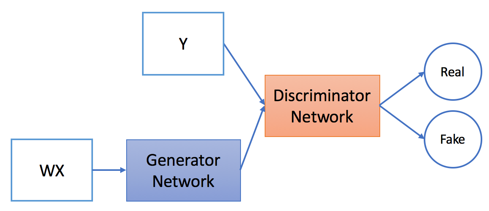

## General domain adaptation
This problem can be generalized into the domain adaptation problem.

By domain adaptation, which mean any algorithm trying to transfer two domains, usually called source and target (for instance paintings and real photos), into a common domain. To do so, one can chose either to translate one domain into the other (e.g. translate paintings to photos, Api2Api) or to find a common embedding between the two domains (DeepAM).

Generative Adversarial Networks (Goodfelllow et al.) (GANs) emerges to perform very well for the image generation task. By adversarial training, providing the the generator fake data (real data with some noise), the model tries to train the discriminator to maximize its ability to distinguish between real and fake data, and the generator tries to minimize such ability of the discriminator by fooling the discriminator that its provided images were real. The model converges also means that the generator has maximize its ability to generate fake data as realistic as real data. Figure below illustrates GANs:

This approach is then explored into a general domain adaptation (Ganin et al.) where the networks try to minimize the difference between the 2 source and target domain to make them as similar as possible)

In this paper, imaging that if WX is the fake data, and Y is the real data, we try to make WX and Y as similar as possible ==> feasible for the GAN training  ==> this is the core of our idea. Figure below illustrates the idea:

## Refinement
it's not easy to unsupervisedly map the 2 vector spaces together in one shot since the distributions of the APIs in 2 spaces are quite different ==> refinement is the key to close the gap with supervised approach (details can be found in the paper)
