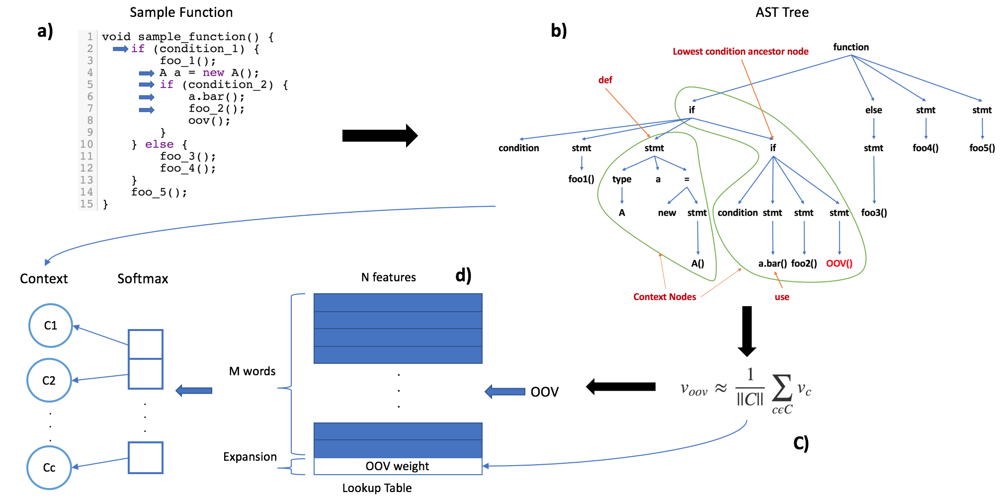

## OOV Handling

Most of the previous work collect stable and fixed data and build the model on that data ==> not suitable for real usage since software evolves very fast. 
A possible way is to continue training the model from old model since neural-network has the ability to save and resume the model at anytime ==> new data may not have enough context that reflect their best position in the vector space 
==> Need the ability for OOV handling on-the-fly with minimal context provided (details can be found in the paper)

We proposed a method to estimate the embedding of OOV on-the-fly with the minimal surrounding contexts. The estimation involves 2 parts:
- Traversing the AST to extract the context sequence
- Performing a simple average the embeddings of the context to get a good initialization of the OOV, so called Bag-Of-Words of embeddings.

The below Figure illustrates the OOV esitmation steps.
a) Firstly, we have the sample source code. In concrete, the sample source code is a whole function body.
b) Secondly, we parse the source code into the AST and traverse the AST to get the context sequence.
c) Thirdly, from the context sequence, we average the embeddings to get the initial weight of the OOV
d) Finally, perform the feed forward and backpropagation on the skip-gram model to estimate the OOV's embedding.

