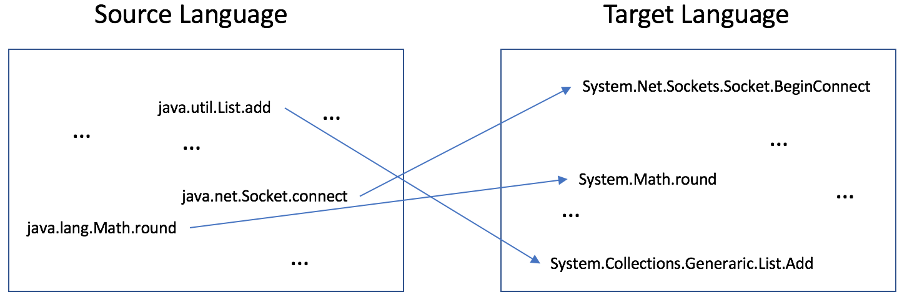

## SAR: Learning Cross-Language API Mappings with Little Knowledge, ESEC/FSE 2019
* [Domain Adaptation](https://github.com/bdqnghi/SAR_mapping/blob/master/DOMAIN_ADAPTATION.md): this part provides an intuitive explanation of domain adaptation
* [Usage of source code in Python](https://github.com/bdqnghi/SAR_mapping/blob/master/README.md#usage)
* Data: will be provided later
* [Newly found mappings](https://github.com/bdqnghi/SAR_mapping/blob/master/new_found/new_found_apis.csv): the list of 425 newly found API mappings.
  
## Problem
**Cross-language API mappings**: to provide mappings of similar APIs across languages, e.g Figure below.


* Why the mappings are useful?
  - Most of the language translation tools today, e.g J2CSTranslator, Java2Csharp are operated based on a list of configuration mappings between languages. Example of such configurations:
    - https://github.com/ydanila/sharpen_imazen_config/blob/master/sharpen.config/src/sharpen/config/MEConfiguration.java
  - As a result, intuitively, more accurate mappings added to the configuration file leads to better translation and reduce error rate.

In addition, most of the previous work focus on mining the mappings on a stable dataset. Even though if the dataset is large, it doesn't reflect the fast evolution of software as new APIs are added.

**Prominent previous work**: MAM, StaMiner, Api2Api, DeepAM. Among them, Api2Api and DeepAM are the neural-based methods that proved the advantages against MAM and StaMiner, we focus on these work.


* Api2Api: To compute a translation matrix W based on a large number of  seeds (dictionary), the matrix then is used to generalize the mapping between the 2 vector spaces X and Y, such that Y = WX (can also say translate X to Y)

* DeepAM: To find a joint embedding space that can both represent them together.

**Common ground**: to find some intermediate layer that can connect the 2 vector spaces, so-called the joint embedding space.

**Common drawback**: both require some form of parallel data, which is not easy to achieve. These can be seen as the supervised learning approach.

* Api2Api: require a large amount of dictionary to compute a good translation matrix, 
* DeepAM: require a large amount of <code, text description> pair to compute the joint embedding

Is there another way to map the 2 vector spaces without the need for parallel data? Or is there an unsupervised approach that can adapt the 2 spaces?

## Core idea
To represent 2 languages as the domain vector spaces X and Y and try to align them together with very little supervision. This problem can be generalized into the domain adaptation problem, more intuive explaination can be found [here](https://github.com/djxvii/fse2019/blob/master/DOMAIN_ADAPTATION.md)

## Usage


### Dependencies
* Python 2/3 with [NumPy](http://www.numpy.org/)/[SciPy](https://www.scipy.org/)
* [PyTorch](http://pytorch.org/)
* [Faiss](https://github.com/facebookresearch/faiss) (recommended) for fast nearest neighbor search (CPU or GPU).

Available on CPU or GPU, in Python 2 or 3. Faiss is *optional* for GPU users - though Faiss-GPU will greatly speed up the nearest neighbor search - and *highly recommended* for CPU users. Faiss can be installed using "conda install faiss-cpu -c pytorch" or "conda install faiss-gpu -c pytorch".


### Run the code: adversarial training and refinement (CPU|GPU)
A sample command to learn a mapping using adversarial training and iterative Procrustes refinement:
```bash
python3 unsupervised.py --src_lang java --tgt_lang cs --src_emb data/java_vectors_sdk_functions_api_tokens_with_keywords_50_15.txt --tgt_emb data/cs_vectors_sdk_functions_api_tokens_with_keywords_50_15.txt --n_refinement 2 --emb_dim 50 --max_vocab 300000 --epoch_size 100000 --n_epochs 1 --identical_dict_path "dict/candidates_dict.txt" --dico_eval "eval/java-cs.txt"
```
### Evaluate cross-lingual embeddings (CPU|GPU)

```bash
python evaluate.py --src_lang java --tgt_lang cs --src_emb dumped/debug/some_id/vectors-java.txt --tgt_emb dumped/debug/some_id/vectors-cs.txt --dico_eval "eval/java-cs.txt" --max_vocab 200000
```
### Some explanations and tips:
* **n_epochs**: number of epochs, usually up to 5 is good enough.
* **epoch_size**: size of the epoch to run over the training data once, for large vocabulary(e.g 100.000 words), should be around 500.000-1.000.000. The current default is 100.000
* **n_refinement**: number of refinement steps, usually the result converges after 2 iterations if the initial results are already good.
* **emb_dim**: size of the input embeddings, now the default is 50, 50 is also the recommended size to get a good performance. 
* **identical_dict_path**: path to the synthetic dictionary. Since we're based on class and method name to induce a synthetic dictionary for the refinement, it needs to be precalculated and store to somewhere first, otherwise, the computation will be slow if the size of the 2 input embeddings is large. Initially, if there is no synthetic dictionary, the program needs to generate it for the first time and may take some times to finish generating, depending on the size of the embeddings.
* **dico_eval**: path to the evaluation dictionary
* If the discriminator loss reaches 0.35, it's a good sign that the model converges, more training may not affect much.
* After the training step, a new folder is generated under "dumped/debug" with a unique ID each time a script is running, new embeddings are written in there.
